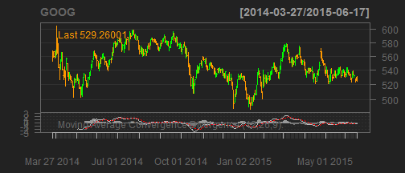
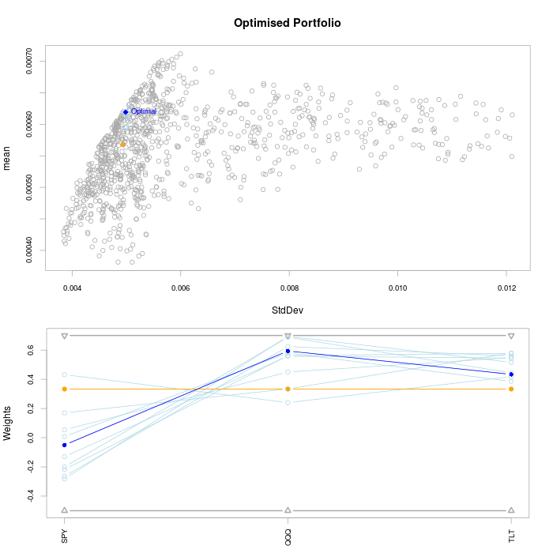

## Overview

Name of my application: stockVis app

Its created from tutorial 6 on shiny.rstudio.com

Three pages are created for technical analysis of different stocks

Last page creates optimal portfolio using PortfolioAnalytics package

--- .id class #id

## Stock Analysis

Stock chart with different layout settings and some technical indicators are possible for every stock on yahoo.finance.com. Lets look on Google example!!

--- 

## Google Stock


```
## [1] "GOOG"
```

 

--- 

## Portfolio Optimiser

Last page is devoted to simple portfolio optimiser of three stocks. Different constraints and number of simulations can be choosen by user. The portfolio optimiser use past performance in selected date range of three selected stock. Ouptut is figure with mean-variance chart and weights for selected stock of optimal portfolio and closest neighbors.

---

## Portfolio Optimiser Example

<center>

<center>


